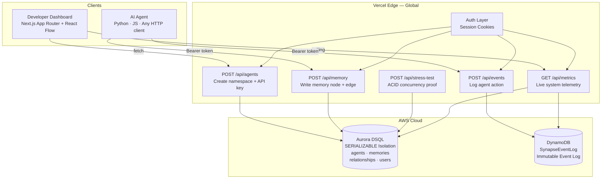

<div align="center">

# SYNAPSE

**Stateful Memory Infrastructure for Autonomous AI Agents**

[](https://nextjs.org)
[](https://vercel.com)
[](https://aws.amazon.com/rds/aurora/dsql/)
[](https://aws.amazon.com/dynamodb/)
[](https://www.typescriptlang.org)
[](LICENSE)

---

*Every AI agent built today is stateless. They forget user context between sessions, hallucinate without persistent memory, and corrupt shared state when multiple agents write concurrently. Synapse is a B2B SaaS platform that gives autonomous agents a transactional, ACID-compliant memory layer — built on Aurora DSQL for relational state and DynamoDB for immutable event logging. Deployed on Vercel for sub-50ms global latency.*

</div>

---

## The Problem — The Stateless Agent Crisis

The AI agent ecosystem has a fundamental infrastructure gap. Developers can build intelligent agents in hours, but they have no reliable way to give those agents memory that survives beyond a single session.

### Four Failure Modes Killing Production AI

**Context Window Limits**
LLMs forget everything beyond their token limit. Critical user preferences, past decisions, and conversation history evaporate between sessions. Agents treat every interaction as if it's the first — producing inconsistent, often contradictory outputs for returning users.

**Race Conditions Under Concurrency**
When two agents — for example, `CustomerSupport-Alpha` and `Billing-Dispute-Bot` — write to shared state simultaneously, traditional vector databases offer no transactional guarantees. There are no locks, no isolation levels, no rollback mechanisms. State corruption is not a theoretical risk — it is an operational inevitability at scale.

**No Audit Trail**
Agent actions disappear into black boxes. When something goes wrong at 2am, teams cannot replay what happened, cannot determine which agent wrote what, and cannot satisfy enterprise compliance requirements. Debugging a multi-agent system without an immutable event log is forensic archaeology.

**Integration Friction**
Existing "memory" solutions demand complex orchestration frameworks — LangChain memory chains, custom Redis TTL layers, homegrown Postgres schemas. Developers want a database endpoint and an API key, not another framework to learn and maintain.

### A Real-World Incident

> *FinFlow, a Series-A fintech startup, deployed 12 autonomous agents for customer onboarding automation in Q1 2024. After 3 weeks in production, 34% of agent interactions contained hallucinated "memories" of user preferences that never existed. Two agents had written conflicting state to the same customer record within the same 200ms window. With no event log, there was no way to audit which agent wrote what data or when. The cost: $240K in customer remediation credits and a complete shutdown of the agent fleet. The root cause: no transactional memory layer.*

---

## The Solution — Synapse Architecture

Synapse solves this with a purpose-built dual-database architecture that separates concerns cleanly: relational ACID state goes to Aurora DSQL, and immutable event streams go to DynamoDB.

### Dual-Database Design

**Aurora DSQL — Relational State**
Distributed SQL with `SERIALIZABLE` isolation. Handles concurrent agent writes to shared state with zero conflicts. Schema-enforced relational integrity across agents, memories, and relationships. Every write is atomic. Every read is consistent.

**DynamoDB — Immutable Event Log**
Single-table design for infinite-scale event ingestion. Every agent action becomes an immutable record — written once, never updated. Enables per-agent chronological replay at any point in time. Full auditability, perfect replayability, zero schema migrations.

**Vercel — Global Edge Delivery**
Next.js 14 App Router deployed on Vercel's global edge network. API routes execute within 50ms of the requester. The dashboard streams live metrics from both databases in a single round trip.

### System Architecture



### The ACID Compliance Proof

Synapse ships with a live stress-test suite accessible from the Metrics dashboard. Clicking "Run ACID Test" fires 50 concurrent write operations to Aurora DSQL and reports:

- **Total writes attempted** vs **successful** vs **failed**
- **Writes per second** sustained throughput
- **Zero data loss** under concurrent load — every write either commits fully or rolls back, no partial states

This is not a benchmark claim. It is a live, observable demonstration with real database connections.

---

## Target Audience

| Role | Pain Point | How Synapse Solves It |
|---|---|---|
| **AI Backend Engineer** | Building LangChain / CrewAI agents that forget context between sessions | Drop-in REST API — write a memory node with one `POST`, retrieve the full graph with one `GET` |
| **AI Startup CTO** | Agents corrupting shared state under concurrent load; no transactional guarantees from vector DB | Aurora DSQL with `SERIALIZABLE` isolation eliminates race conditions at the database layer |
| **Enterprise Architect** | Regulatory requirement to audit all AI agent decisions and actions | Immutable DynamoDB event log — every action timestamped, persisted forever, replayable |
| **Full-Stack Developer** | Spending weeks building custom Redis/Postgres memory layers for every new agent project | Managed API — provision a namespace, get an API key, start writing in minutes |
| **Compliance Officer** | Black-box AI decisions failing audit requirements | Per-agent event streams with full forensic replay capability |

---

## Try It Live

The dashboard is production-deployed. Sign in with the sample credentials to explore a pre-seeded agent namespace with live data:

```
Email:    robertsamueli40@gmail.com
Password: Synapse@123
```

From the dashboard you can:

1. **View the Live Memory Graph** — nodes and edges rendered in React Flow, data from Aurora DSQL
2. **Stream the Event Feed** — real-time DynamoDB event log with relative timestamps and action type filters
3. **Run the ACID Stress Test** — 50 concurrent writes, observable pass/fail in the Metrics panel
4. **Run the Simulation** — continuous event generation to show live throughput metrics
5. **Create your own Agent Namespace** — provision a new namespace and receive an API key

---

## Tech Stack

### Core

| Layer | Technology | Version | Role |
|---|---|---|---|
| Framework | Next.js App Router | 14.2.35 | Server Components, API routes, streaming |
| Language | TypeScript | 5.4+ | End-to-end type safety |
| Runtime | Node.js | 20.x | Vercel serverless runtime |
| Styling | Tailwind CSS | 3.4+ | Utility-first, dark-mode native |

### Databases

| Database | Version | Purpose |
|---|---|---|
| Aurora DSQL | AWS SDK v3.1073 | ACID-compliant relational state |
| DynamoDB | AWS SDK v3.1073 | Immutable event log |

### Visualization & UI

| Library | Version | Purpose |
|---|---|---|
| React Flow | 11.11.4 | Interactive memory graph |
| Lucide React | 1.21.0 | Icon system |
| shadcn/ui | — | Component primitives |

---

## Getting Started

### Prerequisites

- Node.js 20.x+
- An AWS account with Aurora DSQL cluster and DynamoDB table provisioned
- A Vercel account (optional — runs locally without it)

### 1. Clone and Install

```bash
git clone https://github.com/Sam04-dev/Synapse.git
cd Synapse
npm install
```

### 2. Configure Environment

Create `.env.local` at the project root:

```env
# Aurora DSQL
POSTGRES_HOST=your-cluster.dsql.us-east-1.on.aws
POSTGRES_PORT=5432
POSTGRES_DB=postgres
POSTGRES_USER=admin
POSTGRES_PASSWORD=your-token

# DynamoDB
AWS_REGION=ap-southeast-2
AWS_ACCESS_KEY_ID=your-access-key
AWS_SECRET_ACCESS_KEY=your-secret-key
DYNAMODB_TABLE_NAME=SynapseEventLog

# Auth
JWT_SECRET=your-32-char-minimum-secret-here
```

> **SSL Certificate**: Download the [Aurora DSQL global CA bundle](https://truststore.pki.rds.amazonaws.com/global/global-bundle.pem) and place it as `global-bundle.pem` in the project root.

### 3. Initialize Schema

```bash
curl -X POST http://localhost:3000/api/setup
```

### 4. Run Locally

```bash
npm run dev
# → http://localhost:3000
```

### 5. Seed Sample Data (Optional)

```bash
curl -X POST http://localhost:3000/api/seed
```

---

## API Reference

All endpoints accept and return `application/json`. Error responses: `{ "error": "string", "code": number }`.

### Authentication

```http
POST /api/auth/signup
{ "email": "you@example.com", "password": "min8chars" }
```

```http
POST /api/auth/login
{ "email": "you@example.com", "password": "your-password" }
```

Session is returned as an `httpOnly` cookie. All subsequent requests include it automatically.

---

### Agents

```http
GET  /api/agents           → { "agents": [{ "id", "name", "createdAt", "apiKeyHash" }] }
POST /api/agents           → { "id", "name", "createdAt", "apiKey" }  ← shown once only
DELETE /api/agents/:id     → { "success": true }
```

---

### Memory

```http
POST /api/memory
{
  "agentId": "uuid",
  "memoryContent": "User prefers dark mode and metric units",
  "relationshipType": "PREFERS",
  "parentMemoryId": "uuid"
}
```

```http
GET /api/memory?agentId=uuid
→ {
    "nodes": [{ "id", "content", "timestamp", "type" }],
    "edges": [{ "id", "source", "target", "label" }]
  }
```

---

### Events

```http
POST /api/events
{
  "agentId": "uuid",
  "action": "MEMORY_CREATED",
  "payload": { "key": "value" }
}
→ { "success": true }
```

---

### Metrics

```http
GET /api/metrics
→ {
    "memories": number,
    "agents": number,
    "events": number,
    "eventsPerSec": number,
    "avgLatencyMs": number,
    "dsqlStatus": "connected",
    "dynamoStatus": "connected"
  }
```

---

### Stress Test

```http
POST /api/stress-test
→ {
    "totalWrites": 50,
    "successful": 50,
    "failed": 0,
    "durationMs": 234,
    "writesPerSecond": 213.7
  }
```

---

## Security

- **Sessions** — Signed with HMAC-SHA256, `httpOnly` cookies, 7-day TTL, timing-safe verification
- **API Keys** — SHA-256 hashed before storage; raw key shown once at creation, never stored
- **Database** — All connections use TLS; credentials live only in environment variables
- **No client-side secrets** — All AWS and database calls run server-side only; the browser never sees credentials

---

## Why Aurora DSQL Over Alternatives

| Solution | ACID Transactions | Concurrent Agent Writes | Relational Integrity | Scalability |
|---|---|---|---|---|
| **Aurora DSQL** (Synapse) | ✅ SERIALIZABLE | ✅ Zero conflicts | ✅ FK constraints | ✅ Distributed |
| Pinecone / Weaviate | ❌ None | ❌ No isolation | ❌ No schema | ✅ |
| Redis | ❌ Optimistic only | ⚠️ WATCH/MULTI | ❌ No relational | ⚠️ |
| Supabase (Postgres) | ✅ | ⚠️ Connection limits | ✅ | ⚠️ Vertical |
| Firebase Firestore | ⚠️ Single-doc only | ⚠️ | ❌ | ✅ |
| SQLite (local) | ✅ | ❌ Write-serialized | ✅ | ❌ |

Aurora DSQL is the only solution that delivers full SQL semantics, `SERIALIZABLE` isolation, and horizontal distribution simultaneously — the exact combination required for multi-agent concurrent writes at scale.

---

## Roadmap

### v0.2 — Agent SDK
- Python and JavaScript client libraries
- Automatic memory compression when context window approaches limit
- Streaming event webhooks

### v0.3 — Team Collaboration
- Shared namespaces across team members
- Role-based access control (read-only vs. read-write API keys)
- Per-namespace usage quotas

### v0.4 — Enterprise
- SSO via SAML 2.0 / OIDC
- Audit log export (S3, Splunk, Datadog)
- On-premise deployment
- Custom SLA with 99.99% uptime guarantee

### v1.0 — Production GA
- Stripe billing integration (Starter / Pro / Enterprise tiers live)
- Multi-region deployment (us-east-1 + eu-west-1 + ap-southeast-2)
- Real-time WebSocket event streaming
- Memory summarization via LLM compression

---

## Contributing

1. Fork the repository
2. Create a feature branch: `git checkout -b feat/your-feature`
3. Open a pull request with a description of the change and its motivation

---

## Privacy & Security Policy

Synapse stores developer API keys as SHA-256 hashes only. Raw keys cannot be recovered. Agent memory content is stored in Aurora DSQL and is isolated per agent namespace. Event logs in DynamoDB are append-only. No user behavioral data is sold or shared with third parties. All data is encrypted in transit (TLS 1.2+) and at rest (AES-256, AWS managed keys).

For security disclosures, contact: **founders@synapse.engine**

---

## License

Apache License 2.0 — see [LICENSE](LICENSE) for details.

Copyright 2026 Sam04-dev. Licensed under the Apache License, Version 2.0.

---

<div align="center">

Built for the **H0 Hackathon — Open Innovation Track**

*Real databases. Real ACID transactions. Real infrastructure.*

**[Launch App](https://synapse.vercel.app) · [API Docs](/docs) · [Pricing](/pricing)**

</div>
