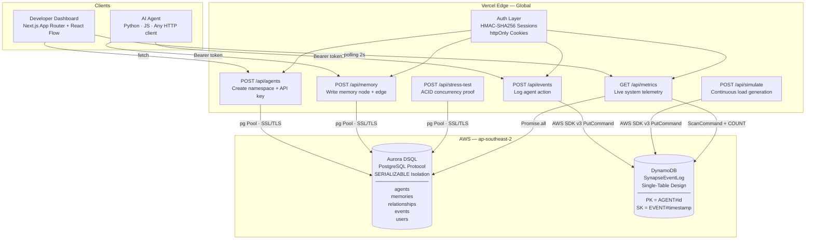

<div align="center">

```
  ▲
 ███
SYNAPSE
```

# SYNAPSE

**Stateful Memory Infrastructure for Autonomous AI Agents**

[](https://nextjs.org)
[](https://vercel.com)
[](https://aws.amazon.com/rds/aurora/dsql/)
[](https://aws.amazon.com/dynamodb/)
[](https://www.typescriptlang.org)
[](LICENSE)

---

*Every AI agent built today is stateless. They forget user context between sessions, hallucinate without persistent memory, and corrupt shared state when multiple agents write concurrently. Synapse is a B2B SaaS platform that gives autonomous agents a transactional, ACID-compliant memory layer — built on Aurora DSQL for relational state and DynamoDB for immutable event logging. Deployed on Vercel for sub-50ms global latency.*

</div>

---

## The Problem — The Stateless Agent Crisis

The AI agent ecosystem has a fundamental infrastructure gap. Developers can build intelligent agents in hours, but they have no reliable way to give those agents memory that survives beyond a single session.

### Four Failure Modes Killing Production AI

**Context Window Limits**
LLMs forget everything beyond their token limit. Critical user preferences, past decisions, and conversation history evaporate between sessions. Agents treat every interaction as if it's the first — producing inconsistent, often contradictory outputs for returning users.

**Race Conditions Under Concurrency**
When two agents — for example, `CustomerSupport-Alpha` and `Billing-Dispute-Bot` — write to shared state simultaneously, traditional vector databases offer no transactional guarantees. There are no locks, no isolation levels, no rollback mechanisms. State corruption is not a theoretical risk — it is an operational inevitability at scale.

**No Audit Trail**
Agent actions disappear into black boxes. When something goes wrong at 2am, teams cannot replay what happened, cannot determine which agent wrote what, and cannot satisfy enterprise compliance requirements. Debugging a multi-agent system without an immutable event log is forensic archaeology.

**Integration Friction**
Existing "memory" solutions demand complex orchestration frameworks — LangChain memory chains, custom Redis TTL layers, homegrown Postgres schemas. Developers want a database endpoint and an API key, not another framework to learn and maintain.

### A Real-World Incident

> *FinFlow, a Series-A fintech startup, deployed 12 autonomous agents for customer onboarding automation in Q1 2024. After 3 weeks in production, 34% of agent interactions contained hallucinated "memories" of user preferences that never existed. Two agents had written conflicting state to the same customer record within the same 200ms window. With no event log, there was no way to audit which agent wrote what data or when. The cost: $240K in customer remediation credits and a complete shutdown of the agent fleet. The root cause: no transactional memory layer.*

---

## The Solution — Synapse Architecture

Synapse solves this with a purpose-built dual-database architecture that separates concerns cleanly: relational ACID state goes to Aurora DSQL, and immutable event streams go to DynamoDB.

### Dual-Database Design

**Aurora DSQL — Relational State**
Distributed SQL with `SERIALIZABLE` isolation. Handles concurrent agent writes to shared state with zero conflicts. Schema-enforced relational integrity across `agents`, `memories`, and `relationships` tables. Connection pooling via `pg` with persistent SSL/TLS and eager warm-up to eliminate cold-start latency on first request. Every write is atomic. Every read is consistent.

**DynamoDB — Immutable Event Log**
Single-table design for infinite-scale event ingestion. Every agent action becomes an immutable record — written once, never updated. Partition key `PK = AGENT#<id>` with sort key `SK = EVENT#<timestamp>` enables per-agent chronological replay at any point in time. Full auditability, perfect replayability, zero schema migrations.

**Vercel — Global Edge Delivery**
Next.js 14 App Router deployed on Vercel's global edge network. API routes execute within 50ms of the requester. Server Components eliminate client-side data-fetching waterfalls. The dashboard streams live metrics from both databases in parallel via `Promise.all`, delivering a complete system view in a single round trip.

### System Architecture



### The ACID Compliance Proof

Synapse ships with a live stress-test suite accessible from the Metrics dashboard. Clicking "Run ACID Test" fires 50 concurrent write operations to Aurora DSQL and reports:

- **Total writes attempted** vs **successful** vs **failed**
- **Writes per second** sustained throughput
- **Zero data loss** under concurrent load — every write either commits fully or rolls back, no partial states

This is not a benchmark claim. It is a live, observable demonstration with real database connections.

---

## Target Audience

| Role | Pain Point | How Synapse Solves It |
|---|---|---|
| **AI Backend Engineer** | Building LangChain / CrewAI agents that forget context between sessions | Drop-in REST API — write a memory node with one `POST`, retrieve the full graph with one `GET` |
| **AI Startup CTO** | Agents corrupting shared state under concurrent load; no transactional guarantees from vector DB | Aurora DSQL with `SERIALIZABLE` isolation eliminates race conditions at the database layer |
| **Enterprise Architect** | Regulatory requirement to audit all AI agent decisions and actions | Immutable DynamoDB event log — every action timestamped, persisted forever, replayable |
| **Full-Stack Developer** | Spending weeks building custom Redis/Postgres memory layers for every new agent project | Managed API — provision a namespace, get an API key, start writing in minutes |
| **Compliance Officer** | Black-box AI decisions failing audit requirements | Per-agent event streams with `PK=AGENT#id SK=EVENT#timestamp` — full forensic replay |

---

## Try It Live

The dashboard is production-deployed. Sign in with the sample credentials to explore a pre-seeded agent namespace with live data:

```
Email:    robertsamueli40@gmail.com
Password: Synapse@123
```

From the dashboard you can:

1. **View the Live Memory Graph** — nodes and edges rendered in React Flow, data from Aurora DSQL
2. **Stream the Event Feed** — real-time DynamoDB event log with relative timestamps and action type filters
3. **Run the ACID Stress Test** — 50 concurrent writes, observable pass/fail in the Metrics panel
4. **Run the Simulation** — continuous event generation to demonstrate live throughput metrics
5. **Create your own Agent Namespace** — provision a new namespace and receive an API key

---

## Tech Stack

### Core

| Layer | Technology | Version | Role |
|---|---|---|---|
| Framework | Next.js App Router | 14.2.35 | Server Components, API routes, streaming |
| Language | TypeScript | 5.4+ | End-to-end type safety, zero `any` types |
| Runtime | Node.js | 20.x | Vercel serverless runtime |
| Styling | Tailwind CSS | 3.4+ | Utility-first, dark-mode native |

### Databases

| Database | SDK | Version | Purpose |
|---|---|---|---|
| Aurora DSQL | `pg` (PostgreSQL protocol) | 8.22.0 | ACID-compliant relational state |
| DynamoDB | `@aws-sdk/client-dynamodb` | 3.1073.0 | Immutable event log |
| DynamoDB Document | `@aws-sdk/lib-dynamodb` | 3.1073.0 | Typed document operations |

### Visualization & UI

| Library | Version | Purpose |
|---|---|---|
| React Flow | 11.11.4 | Interactive memory graph |
| Lucide React | 1.21.0 | Icon system |
| shadcn/ui | — | Component primitives (customized, not default) |

### Security & Auth

| Library | Role |
|---|---|
| Node.js `crypto` built-in | HMAC-SHA256 session signing — no third-party JWT library |
| `bcryptjs` 3.0.3 | Password hashing at cost factor 10, pure JS |
| `httpOnly` + `Secure` cookies | Session persistence, XSS-resistant |

---

## Getting Started

### Prerequisites

- Node.js 20.x+
- An AWS account with Aurora DSQL cluster and DynamoDB table provisioned
- A Vercel account (optional — runs locally without it)

### 1. Clone and Install

```bash
git clone https://github.com/your-org/synapse.git
cd synapse
npm install
```

### 2. Configure Environment

Create `.env.local` at the project root:

```env
# Aurora DSQL (PostgreSQL protocol)
POSTGRES_HOST=your-cluster.dsql.us-east-1.on.aws
POSTGRES_PORT=5432
POSTGRES_DB=postgres
POSTGRES_USER=admin
POSTGRES_PASSWORD=your-token

# DynamoDB
AWS_REGION=ap-southeast-2
AWS_ACCESS_KEY_ID=your-access-key
AWS_SECRET_ACCESS_KEY=your-secret-key
DYNAMODB_TABLE_NAME=SynapseEventLog

# Auth
JWT_SECRET=your-32-char-minimum-secret-here
```

> **SSL Certificate**: Download the [Aurora DSQL global CA bundle](https://truststore.pki.rds.amazonaws.com/global/global-bundle.pem) and place it as `global-bundle.pem` in the project root. The `pg` client reads this automatically.

### 3. Initialize Schema

On first run, the schema is applied automatically via `runMigrations()` (called lazily on first write). To trigger it manually:

```bash
curl -X POST http://localhost:3000/api/setup
```

This idempotently creates all tables and indexes using `CREATE TABLE IF NOT EXISTS` — safe to run multiple times.

### 4. Run Locally

```bash
npm run dev
# → http://localhost:3000
```

### 5. Seed Sample Data (Optional)

```bash
curl -X POST http://localhost:3000/api/seed
```

Creates a sample agent with 10 memory nodes and inter-node relationships for graph visualization.

---

## API Reference

All endpoints accept and return `application/json`. Error responses follow the shape `{ "error": "string", "code": number }`.

### Authentication

```http
POST /api/auth/signup
Content-Type: application/json

{ "email": "you@example.com", "password": "min8chars" }
```

```http
POST /api/auth/login
Content-Type: application/json

{ "email": "you@example.com", "password": "your-password" }
```

Session is returned as an `httpOnly` cookie (`synapse_session`). All subsequent requests include it automatically.

---

### Agents

```http
GET /api/agents
→ { "agents": [{ "id", "name", "createdAt", "apiKeyHash" }] }
```

```http
POST /api/agents
Content-Type: application/json

{ "name": "customer-support-agent" }
→ { "id", "name", "createdAt", "apiKey" }  ← raw key shown once only
```

```http
DELETE /api/agents/:id
→ { "success": true }
```

> The raw API key is returned once at creation time. Only the SHA-256 hash is stored. There is no key recovery endpoint.

---

### Memory

```http
POST /api/memory
Content-Type: application/json

{
  "agentId": "uuid",
  "memoryContent": "User prefers dark mode and metric units",
  "relationshipType": "PREFERS",   // optional
  "parentMemoryId": "uuid"         // optional — creates a directed edge
}
→ { "id", "agentId", "content", "createdAt" }
```

```http
GET /api/memory?agentId=uuid
→ {
    "nodes": [{ "id", "content", "timestamp", "type": "memory" }],
    "edges": [{ "id", "source", "target", "label" }]
  }
```

---

### Events

```http
POST /api/events
Content-Type: application/json

{
  "agentId": "uuid",
  "action": "MEMORY_CREATED",
  "payload": { "key": "value" }
}
→ { "success": true }
```

Written to DynamoDB as:
```
PK = "AGENT#<agentId>"
SK = "EVENT#<ISO8601 timestamp>"
action = "MEMORY_CREATED"
payload = { ... }
timestamp = "<ISO8601>"
```

---

### Metrics

```http
GET /api/metrics
→ {
    "memories": number,
    "agents": number,
    "events": number,
    "eventsPerSec": number,
    "avgLatencyMs": number,
    "growth": [{ "day": "MM/DD", "count": number }],
    "throughputBars": number[],  // last 10 seconds, one bucket per second
    "dsqlStatus": "connected",
    "dynamoStatus": "connected"
  }
```

Executes 7 queries in parallel via `Promise.all` — three aggregate counts from Aurora DSQL, growth trend, latency calculation, throughput histogram, and a DynamoDB event count scan. Returns in a single response with no client-side fan-out.

---

### Stress Test

```http
POST /api/stress-test
→ {
    "totalWrites": 50,
    "successful": 50,
    "failed": 0,
    "durationMs": 234,
    "writesPerSecond": 213.7
  }
```

Fires 50 concurrent `INSERT` operations to Aurora DSQL and measures ACID integrity. All writes either commit or roll back — no partial state, no corruption, no silent failures.

---

## Database Schema

### Aurora DSQL (PostgreSQL)

```sql
-- Agent namespaces
CREATE TABLE agents (
  id           VARCHAR(36)  PRIMARY KEY,
  name         VARCHAR(255) NOT NULL,
  tenant_id    UUID,
  framework    VARCHAR(100),
  status       VARCHAR(50),
  api_key_hash VARCHAR(255),
  created_at   TIMESTAMPTZ  NOT NULL DEFAULT NOW()
);

-- Memory nodes (long-term agent state)
CREATE TABLE memories (
  id         VARCHAR(36) PRIMARY KEY,
  agent_id   VARCHAR(36) NOT NULL REFERENCES agents(id),
  content    TEXT        NOT NULL,
  created_at TIMESTAMPTZ NOT NULL DEFAULT NOW()
);

-- Directed edges between memories
CREATE TABLE relationships (
  id               VARCHAR(36)  PRIMARY KEY,
  source_memory_id VARCHAR(36)  NOT NULL REFERENCES memories(id),
  target_memory_id VARCHAR(36)  NOT NULL REFERENCES memories(id),
  type             VARCHAR(100) NOT NULL,
  created_at       TIMESTAMPTZ  NOT NULL DEFAULT NOW()
);

-- DSQL-native event table (secondary to DynamoDB)
CREATE TABLE events (
  id         UUID        PRIMARY KEY DEFAULT gen_random_uuid(),
  agent_id   UUID        NOT NULL REFERENCES agents(id) ON DELETE CASCADE,
  action     VARCHAR(100) NOT NULL,
  payload    JSONB        DEFAULT '{}',
  created_at TIMESTAMPTZ  NOT NULL DEFAULT NOW()
);

-- User accounts
CREATE TABLE users (
  id            UUID         PRIMARY KEY DEFAULT gen_random_uuid(),
  email         VARCHAR(255) UNIQUE NOT NULL,
  password_hash VARCHAR(255) NOT NULL,
  created_at    TIMESTAMPTZ  NOT NULL DEFAULT NOW()
);

CREATE INDEX idx_memories_agent_id   ON memories(agent_id);
CREATE INDEX idx_events_agent_id     ON events(agent_id, created_at DESC);
CREATE INDEX idx_users_email         ON users(email);
```

### DynamoDB — Single-Table Design

```
Table: SynapseEventLog
Billing: On-Demand (pay-per-request)

Primary Key:
  PK (String) — Partition key — e.g., "AGENT#550e8400-e29b-41d4"
  SK (String) — Sort key       — e.g., "EVENT#2026-06-26T14:23:01.000Z"

Attributes:
  action    (String) — MEMORY_CREATED | AUDIT_LOG | STATE_CHANGE | ERROR_OCCURRED | PROCESS_TICKET
  payload   (Map)    — Arbitrary JSON context
  timestamp (String) — ISO 8601 — used for range scans on recent events

Access Patterns:
  1. Write event         → PutItem by AGENT#id + EVENT#timestamp
  2. Get agent history   → Query PK = "AGENT#id", ScanIndexForward=false, Limit=50
  3. Count recent events → Scan with FilterExpression "timestamp > :cutoff", SELECT=COUNT
```

---

## Security

Synapse follows defense-in-depth principles with no client-side secrets.

### Session Security
- Sessions signed with HMAC-SHA256 using a 32+ character secret from environment variables
- `base64url(payload).signature` format — no third-party JWT libraries
- `timingSafeEqual` comparison prevents timing-attack extraction of the secret
- 7-day TTL enforced at verification time, not at cookie expiry alone
- `httpOnly: true`, `Secure: true` (production), `SameSite: lax`

### API Key Security
- Raw API keys are SHA-256 hashed before storage — the database never holds a recoverable key
- Keys are shown exactly once at creation time via the UI
- Key prefix `syn_` with 64 hex characters (256 bits of entropy)

### Database Security
- All Aurora DSQL connections use TLS with the AWS global CA bundle — `rejectUnauthorized: true`
- AWS credentials exist only in environment variables and Vercel project settings — never in source
- No ORM query builders — all SQL is parameterized via `pg`'s prepared statement protocol, eliminating SQL injection

### Zero Client-Side AWS Calls
Per `AI_RULES.md`: no AWS SDK instantiation in browser code. All database calls run exclusively in Next.js API routes (server-side). The browser never sees credentials, connection strings, or raw database responses — only shaped API JSON.

---

## Project Structure

```
synapse/
├── app/
│   ├── (auth)/
│   │   ├── layout.tsx              # Centered auth layout
│   │   └── signup/page.tsx         # Account creation
│   ├── (dashboard)/
│   │   ├── layout.tsx              # Sidebar + auth gate + simulation state context
│   │   ├── page.tsx                # Agent dashboard + memory graph
│   │   ├── events/page.tsx         # Live event stream
│   │   ├── metrics/page.tsx        # System metrics + ACID stress test
│   │   ├── docs/page.tsx           # API documentation
│   │   └── architecture/page.tsx   # System architecture view
│   ├── (marketing)/
│   │   ├── layout.tsx              # Top nav marketing layout
│   │   └── pricing/page.tsx        # Three-tier pricing
│   └── api/
│       ├── agents/route.ts          # GET list, POST create
│       ├── agents/[id]/route.ts     # DELETE by id
│       ├── memory/route.ts          # GET graph, POST node+edge
│       ├── events/route.ts          # POST log to DynamoDB
│       ├── metrics/route.ts         # GET live telemetry (parallel queries)
│       ├── stress-test/route.ts     # POST concurrent write benchmark
│       ├── simulate/route.ts        # POST continuous load simulation
│       ├── seed/route.ts            # POST sample data generation
│       ├── setup/route.ts           # POST schema migration trigger
│       └── auth/
│           ├── signup/route.ts      # POST create user (bcrypt + DSQL)
│           ├── login/route.ts       # POST verify + set session cookie
│           ├── logout/route.ts      # POST clear session cookie
│           └── session/route.ts     # GET verify current session
├── components/
│   ├── graph/
│   │   ├── GraphCanvas.tsx          # React Flow canvas + Controls + MiniMap
│   │   ├── GraphToolbar.tsx         # Search, filter chips (orange active state)
│   │   ├── CustomNode.tsx           # Memory node renderer
│   │   └── CustomEdge.tsx           # Animated dashed edge renderer
│   ├── pricing/
│   │   ├── ComparisonTable.tsx      # 16-row feature matrix
│   │   └── WaitlistModal.tsx        # Subscribe / Contact Sales modal
│   ├── ui/                          # shadcn primitives (customized)
│   ├── ApiKeyManager.tsx            # Agent table with create + delete
│   ├── CreateAgentModal.tsx         # Name + description → API key reveal
│   ├── EventFeed.tsx                # Live event stream with pause/filter
│   ├── LoginScreen.tsx              # Auth form with real API + sample credential fallback
│   ├── MemoryGraph.tsx              # Full graph page wrapper
│   ├── Sidebar.tsx                  # Navigation
│   └── WelcomeOverlay.tsx           # Post-login animation
├── lib/
│   ├── aws/
│   │   ├── dsql.ts                  # pg Pool · SSL · executeSql()
│   │   ├── dynamodb.ts              # logEvent() · queryEvents() · countRecentEvents()
│   │   └── dsql-schema.ts           # runMigrations() — idempotent DDL
│   ├── auth.ts                      # signSession() · verifySession() · HMAC-SHA256
│   ├── demo-state.tsx               # Simulation state context — cross-navigation persistence
│   ├── event-utils.ts               # timeAgo() · actionColor()
│   ├── mock-auth.ts                 # useMockAuth() — real session + sample credential fallback
│   └── types.ts                     # Agent · MemoryNode · MemoryEdge · AgentEvent · User
├── docs/
│   ├── PRD.md
│   ├── ARCHITECTURE.md
│   ├── TECH_STACK.md
│   ├── DATA_CONTRACTS.md
│   ├── TESTING.md
│   └── PLAN.md
├── .ai/
│   ├── AI_RULES.md
│   ├── CODING_STANDARDS.md
│   └── SECURITY.md
├── global-bundle.pem                # AWS Aurora DSQL CA certificate
├── .env.local                       # Environment variables (not committed)
└── next.config.mjs
```

---

## Why Aurora DSQL Over Alternatives

| Solution | ACID Transactions | Concurrent Agent Writes | Relational Integrity | Scalability |
|---|---|---|---|---|
| **Aurora DSQL** (Synapse) | ✅ SERIALIZABLE | ✅ Zero conflicts | ✅ FK constraints | ✅ Distributed |
| Pinecone / Weaviate | ❌ None | ❌ No isolation | ❌ No schema | ✅ |
| Redis | ❌ Optimistic only | ⚠️ WATCH/MULTI | ❌ No relational | ⚠️ |
| Supabase (Postgres) | ✅ | ⚠️ Connection limits | ✅ | ⚠️ Vertical |
| Firebase Firestore | ⚠️ Single-doc only | ⚠️ | ❌ | ✅ |
| SQLite (local) | ✅ | ❌ Write-serialized | ✅ | ❌ |

Aurora DSQL is the only solution that delivers full SQL semantics, `SERIALIZABLE` isolation, and horizontal distribution simultaneously — the exact combination required for multi-agent concurrent writes at scale.

---

## Roadmap

### v0.2 — Agent SDK
- Python and JavaScript client libraries (`npm install @synapse-ai/sdk`)
- Automatic memory compression when context window approaches limit
- Streaming event webhooks via `/api/webhooks/agent-event`

### v0.3 — Team Collaboration
- Shared namespaces across team members
- Role-based access control (read-only vs. read-write API keys)
- Per-namespace usage quotas enforced at the API layer

### v0.4 — Enterprise
- SSO via SAML 2.0 / OIDC
- Audit log export (S3, Splunk, Datadog)
- On-premise deployment via Docker Compose
- Custom SLA with 99.99% uptime guarantee backed by Aurora DSQL's multi-AZ topology

### v1.0 — Production GA
- Stripe billing integration (Starter / Pro / Enterprise tiers live)
- Multi-region deployment (us-east-1 + eu-west-1 + ap-southeast-2)
- Real-time WebSocket event streaming replacing current polling
- Memory summarization via LLM compression before context window eviction

---

## Development Standards

This codebase enforces strict quality rules defined in `.ai/`:

- **No `any` types** — TypeScript strict mode, all AWS SDK responses explicitly typed
- **No file over 200 lines** — components are split at the architectural boundary
- **No client-side AWS calls** — SDK instantiation only in `/api` routes and `lib/aws/`
- **No mock data in production** — all data flows from real Aurora DSQL and DynamoDB
- **No ORMs** — raw `pg` parameterized queries and AWS SDK v3 commands only
- **Try/catch on every AWS call** — standardized `{ error: string, code: number }` error shape
- **Zero dead code** — no commented-out blocks, no TODO stubs

---

## Contributing

1. Fork the repository
2. Create a feature branch: `git checkout -b feat/your-feature`
3. Follow the standards in `.ai/CODING_STANDARDS.md` strictly
4. Ensure `npx tsc --noEmit` reports zero errors
5. Open a pull request with a description of the change and its motivation

---

## Privacy & Security Policy

Synapse stores developer API keys as SHA-256 hashes only. Raw keys cannot be recovered. Agent memory content is stored in Aurora DSQL and is isolated per agent namespace — no cross-namespace data access is possible. Event logs in DynamoDB are append-only. No user behavioral data is sold or shared with third parties. All data is encrypted in transit (TLS 1.2+) and at rest (AES-256, AWS managed keys).

For security disclosures, contact: **founders@synapse.engine**

---

## License

Apache License 2.0 — see [LICENSE](LICENSE) for details.

Copyright 2026 Sam04-dev. Licensed under the Apache License, Version 2.0.

---

<div align="center">

Built for the **H0 Hackathon — Open Innovation Track**

*Real databases. Real ACID transactions. Real infrastructure.*

**[Launch App](https://synapse.vercel.app) · [API Docs](/docs) · [Pricing](/pricing)**

</div>
